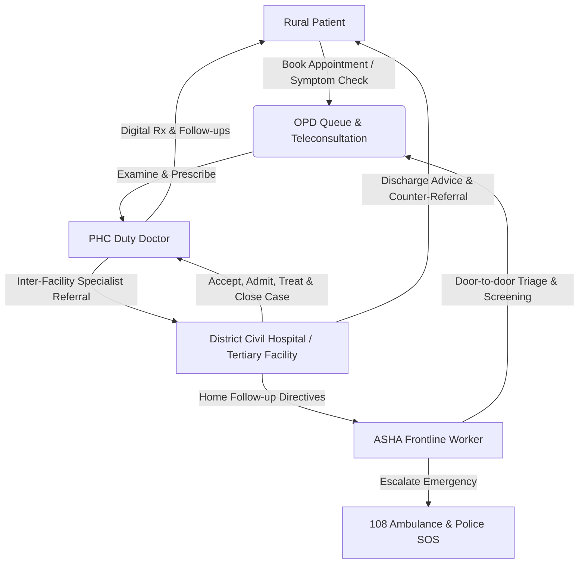

# 🏥 SehatSetu (सेहतसेतु) — Rural Healthcare Access Platform

[](https://frontend-seven-iota-34.vercel.app)
[](https://frontend-seven-iota-34.vercel.app)
[](LICENSE)

> **Problem Statement (SIH26133)**: *“Accessibility and quality of public healthcare services, particularly in rural and underserved areas.”*

**SehatSetu** is an end-to-end connected digital health ecosystem that eliminates healthcare deserts in rural India. It links rural **Patients**, **ASHA Frontline Health Workers**, **PHC Doctors**, and **District Civil Hospitals** into a unified, continuous continuum of care.

🌐 **Live Deployed Application**: [https://frontend-seven-iota-34.vercel.app](https://frontend-seven-iota-34.vercel.app)

---

## 🌟 Connected Multi-Role Ecosystem



---

## 🚀 Key Modules & Capabilities

### 1. 🧑‍🌾 Patient Portal
- **Multilingual Healthcare Experience**: Instant native localization across English, Hindi (हिन्दी), and Marathi (मराठी).
- **Smart OPD Queue Tracker**: Live token allocation, queue status ("Your Turn", "Almost Your Turn"), patients ahead counter, and real-time wait estimation (4 min/patient).
- **Digital Prescriptions**: Tamper-proof prescriptions with NMC doctor registration, medicine instructions (1-0-1), and Ayushman Bharat (ABHA) QR code verification.
- **Smart Medicine Reminders**: Automatic schedule generation (Morning, Afternoon, Evening, Bedtime, SOS) with synthetic Web Audio chimes and daily compliance tracking.
- **Interactive Multi-Hop Referral Tracker**: Amazon/Flipkart-style package tracking for patient transfers from Sub-Centre ➔ Primary Health Centre ➔ District Specialist Hospital with attached vitals.

### 2. 👩‍⚕️ ASHA / Frontline Health Worker Dashboard
- **Rural Population Register**: Manage assigned village households with ABHA ID generation.
- **AI-Guided Digital Clinical Triage**: Rule-based decision support evaluating BP, SpO2, pulse, temp, blood sugar, and red flags (e.g. chest pain, severe bleeding, unconsciousness).
- **Assisted Teleconsultation Requests**: Direct escalation channel to duty medical officers for urgent village cases.
- **High-Risk Case Monitoring**: Continuous tracking for severe gestational anemia, pre-eclampsia, and chronic hypertension.
- **Field Follow-Up Verification**: Complete home visits and log patient compliance directly into the medical record.

### 3. 👨‍⚕️ Doctor Clinical Desk
- **Sequential OPD Desk**: Patient queue in strict ascending token order with non-blocking separation between in-person patients and teleconsultations.
- **One-Click Room Buzzer**: Triggers chime and sets real-time status to "Your Turn" on patient mobile devices.
- **Comprehensive EMR Access**: Longitudinal medical history, allergies (e.g., Penicillin), past treatments, and diagnostic lab reports.
- **Digital Rx & Follow-Up Studio**: Rapid prescription authoring with automatic dose indexing into Jan Aushadhi pharmacy stocks.
- **Clinical Referral Gateway**: Transfer patients to tertiary specialists with complete clinical findings and pre-arrival vitals.

### 4. 🏥 Hospital Facility & Inpatient Transfer Desk
- **Inter-Facility Referral Desk**: Inbound pipeline tracking cases by status:
  - `Referral Sent` ➔ `Accepted by Facility` ➔ `Patient Arrived & Registered` ➔ `Treatment Started` ➔ `Treatment Completed` ➔ `Referral Closed`.
- **Resource Management KPIs**: Live inpatient bed availability (e.g. 24/30 beds, 80% capacity), 108 ambulance fleet status, oxygen cylinder pressure monitoring, and Jan Aushadhi drug inventory.
- **Admissions & Bed Allocation**: Assign attending specialists, inpatient wards, and discharge summaries with counter-referral to PHCs.

### 5. 🚨 108 Emergency SOS & Police Green Corridor
- **One-Touch Emergency SOS**: Computes nearest 108 Advanced Life Support (ALS) ambulance, driver details, phone contact, and dynamic ETA.
- **Inter-Departmental Coordination**: Multi-victim accidents or severe trauma automatically alert the nearest Police Station with PCR patrol dispatch and traffic green corridor clearing.

---

## 🛠️ Technology Stack

| Layer | Technology |
|---|---|
| **Frontend Framework** | React 18.3.1 + Vite 5.4.21 |
| **Styling & UI Tokens** | Pure Vanilla CSS Design System (`index.css`), Lucide Icons |
| **Geospatial & Maps** | Leaflet 1.9.4 |
| **Teleconsultation** | PeerJS (WebRTC Audio/Video) |
| **Backend API** | Node.js (ES Modules) + Express 4.21.2 |
| **Real-time Engine** | Socket.io 4.8.1 + Server-Sent Events (`cloudSyncService`) |
| **Data Persistence** | Atomic JSON File Store (`store.js` + `db.json`) + Client Cache (`localStorage`) |
| **Authentication** | Multi-Role Session Manager, Phone OTP, Firebase Auth, WebAuthn Biometrics |
| **Hosting & CI/CD** | Vercel Serverless Edge Platform |

---

## 💻 Running the Project Locally

### Prerequisites
- Node.js (v18 or higher recommended)
- npm (v9 or higher)

### 1. Clone the Repository
```bash
git clone https://github.com/khushkothari16/SehatSetu.git
cd SehatSetu
```

### 2. Install Dependencies
```bash
# Install frontend dependencies
npm install --prefix frontend

# Install backend dependencies
npm install --prefix backend
```

### 3. Setup Environment Variables
Create `frontend/.env` using the template:
```bash
cp frontend/.env.example frontend/.env
```

### 4. Start the Application

**Option A — Run Backend and Frontend Concurrently:**
```bash
# Terminal 1: Backend Server (runs on http://localhost:5000)
npm run backend

# Terminal 2: Frontend Dev Server (runs on http://localhost:5173)
npm run frontend
```

**Option B — Production Build Verification:**
```bash
npm run build
```

---

## 🧪 Comprehensive QA & Testing Suite

SehatSetu includes an automated test runner verifying all 24 healthcare phases:
```bash
node backend/test_suite.js
```

### Test Artifacts Included:
- 📄 [`TEST_CASES.md`](./TEST_CASES.md) — 38 functional and negative test case specifications.
- 📄 [`BUG_REPORT.md`](./BUG_REPORT.md) — Exhaustive defect catalog, root cause analysis, and remediation records.
- 📄 [`TEST_REPORT.md`](./TEST_REPORT.md) — Phase-by-phase technical audit across all 24 evaluation phases.
- 📄 [`TEST_SUMMARY.md`](./TEST_SUMMARY.md) — Quantitative metrics and the SIH Jury Readiness Report.

---

## 👥 Demo Credentials

| Role | Login Identifier / Email | Password / OTP | Purpose |
|---|---|---|---|
| **Patient** | `9876543210` | `123456` | Book appointments, live queue token, view Rx & reminders |
| **ASHA Worker** | `9765433211` | `123456` | Rural patient roster, digital triage, consult requests |
| **Doctor** | `dr.anjali.mehta@phc.gov.in` | Any / Demo | OPD queue management, buzzer, digital prescriptions |
| **Hospital Admin** | `admin.khedphc@arogya.gov.in` | Any / Demo | Inbound referral acceptance, bed allocation & closure |

---

## 📜 License
Distributed under the MIT License. See `LICENSE` for details.
